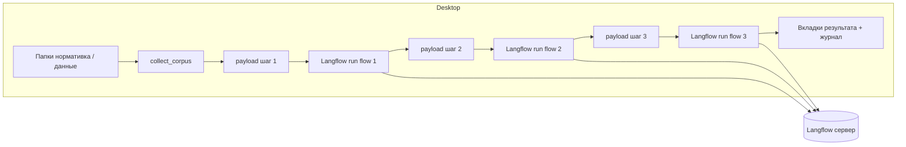

# NormDocs — десктопное приложение «Нормативка → отчёт»

Десктопный клиент на Python: читает **папки** с уже распакованными нормативными документами и вводными данными, собирает текст и последовательно вызывает **три потока Langflow** — форма отчёта, заполнение по данным и проверка по нормативке.

---

## Архитектура

### Слои

| Слой | Назначение | Где в коде |
|------|------------|------------|
| **UI (tkinter/ttk)** | Настройки, выбор папок, шаги 1–3, журнал, отображение результатов | `normdocs_app/ui/main_window.py` |
| **Фоновый конвейер** | Поток воркера: сбор текста → разрешение UUID потоков → три HTTP-вызова к Langflow | `normdocs_app/workers.py` |
| **Конфигурация** | URL, ключ API, UUID потоков (опционально), лимиты текста и таймауты | `normdocs_app/config.py` |
| **Документы** | Обход каталогов, извлечение текста (PDF, DOCX, TXT и др.) с лимитом и логом прогресса | `normdocs_app/services/document_text.py` |
| **Langflow API** | `POST /api/v1/run/{flow_id}`, разбор ответа | `normdocs_app/services/langflow_client.py` |
| **Payload-ы** | Формирование тела запроса под шаги 1–3 | `normdocs_app/services/payloads.py` |
| **Потоки на сервере** | Поиск UUID по именам `NormDocs — 1./2./3.`; создание потоков из шаблонов API | `flow_resolve.py`, `flow_provision.py` |

Точки входа: `run_desktop.py`, `python -m normdocs_app.main`.

### Поток данных (упрощённо)



1. Пользователь указывает каталоги; воркер собирает корпус текста (`document_text.collect_corpus`).
2. `resolve_normdocs_flow_ids` подставляет UUID трёх потоков (по именам на сервере или из env/legacy).
3. Для каждого шага `LangflowClient.run_flow` отправляет запрос с `input_type`/`output_type` chat; ответ парсится в `parse_run_output`.

Сборка EXE (без Langflow внутри): PyInstaller — `build_normdocs_exe.spec`, скрипт `build_normdocs.bat`. В spec тяжёлые пакеты (Langflow, torch и т.д.) **исключены** — приложение только **клиент** HTTP.

---

## Технологии

| Область | Стек |
|--------|------|
| Язык | Python 3 |
| GUI | **tkinter** / **ttk** |
| HTTP | **requests** |
| PDF / DOCX | **PyMuPDF**, **python-docx** |
| Конфиг | **python-dotenv** (корень проекта), JSON настроек под пользователем |
| Упаковка | **PyInstaller** |

---

## Требования

- **Python 3** и отдельное venv для NormDocs (`requirements-normdocs.txt`).
- Отдельно запущенный **Langflow** (см. [официальный Quickstart](https://github.com/langflow-ai/langflow)): например `uv pip install langflow -U` и `uv run langflow run`, UI на `http://127.0.0.1:7860`.
- В Langflow нужен **API-ключ** для вызовов из приложения.
- Документы — **папки** на диске; архивы в приложении не распаковываются.

---

## Установка и запуск приложения

```bash
cd GEO_DOCS
python -m venv .venv
.venv\Scripts\activate
pip install -r requirements-normdocs.txt
```

Создайте `.env` в корне (не коммитится):

```env
LANGFLOW_BASE_URL=http://127.0.0.1:7860
LANGFLOW_API_KEY=ваш_ключ
```

Запуск:

```bash
python run_desktop.py
```

или `python -m normdocs_app.main`.

Настройки дублируются в `%USERPROFILE%\.normdocs_langflow_settings.json`.

---

## Langflow на Windows (важно)

- Установка пакета `langflow` через `pip` в **глубоком пути** (`...\PycharmProjects\...`) может падать с ошибкой длинного пути; рекомендуется [включить Long Paths в Windows](https://pip.pypa.io/warnings/enable-long-paths) **или** ставить/запускать из короткого пути, **или** использовать `uv` по [инструкции Langflow](https://github.com/langflow-ai/langflow): `uv pip install langflow -U`, `uv run langflow run`.
- Примерные и «starter» потоки на сервере могут возвращать **403** при `run`; для работы нужны **свои** потоки (в т.ч. созданные кнопкой «Создать три потока в Langflow»).

---

## Тесты

```bash
pip install -r requirements-dev.txt
pytest
```

Интеграция с живым Langflow (ключ в `.env`, сервер запущен):

```bash
pytest -m live_langflow --override-ini="addopts="
```

---

## Сборка EXE (Windows)

```bash
build_normdocs.bat
```

Результат: `dist\NormDocsLangflow\NormDocsLangflow.exe`. Перед пересборкой закройте запущенный EXE и окно Проводника в `dist\...` (см. комментарии в `build_normdocs.bat`).

---

## Что доделать / известные ограничения

Ниже — актуальное состояние на этапе разработки; пункты можно закрывать по мере проверки.

| Проблема | Суть | Что сделать |
|----------|------|-------------|
| **Пустой ответ LLM в API** | `POST /api/v1/run/...` может вернуть **200**, но в JSON `outputs` внутри блока **пустой** — в GUI тогда попадает сырой JSON или пусто. | В UI Langflow: проверить ключи провайдера в узлах LLM, цепочку до **Chat Output**, отсутствие ошибок на шагах; при необходимости согласовать `output_type` / выходной компонент с тем, как вызывает клиент. |
| **Ключ в `.env`** | Без валидного `LANGFLOW_API_KEY` защищённые эндпоинты не отдают данные. | Подставить реальный ключ из Langflow (Settings → API Keys). |
| **Потоки NormDocs** | Имена должны совпадать с префиксами **`NormDocs — 1.…`**, **`2.…`**, **`3.…`**, иначе авто-поиск UUID не сработает. | Создать потоки кнопкой в приложении или вручную с этими именами; опционально задать UUID через `LANGFLOW_FLOW_*`. |
| **Длинные пути Windows** | Установка `langflow` в venv внутри длинного пути проекта иногда падает. | Long Paths + перезагрузка, короткий путь, или `uv`/отдельный каталог. |
| **`rarfile` в requirements** | Зависимость остаётся; GUI работает с **папками**, не с RAR. | Либо оставить для скриптов/будущего, либо убрать при чистке зависимостей. |

---

## Структура репозитория (основное)

```
normdocs_app/
  main.py
  config.py
  workers.py
  ui/main_window.py
  services/
    document_text.py
    langflow_client.py
    payloads.py
    flow_resolve.py
    flow_provision.py
run_desktop.py
requirements-normdocs.txt
requirements-dev.txt
build_normdocs_exe.spec
build_normdocs.bat
tests/
```

---

## Переменные окружения (справочно)

| Переменная | Назначение |
|------------|------------|
| `LANGFLOW_BASE_URL` | Базовый URL Langflow |
| `LANGFLOW_API_KEY` | API-ключ |
| `LANGFLOW_FLOW_FORM` / `FLOW_FILL` / `FLOW_VERIFY` | UUID потоков (опционально) |
| `NORMDOCS_MAX_CORPUS_CHARS` / `NORMDOCS_MAX_DATA_CHARS` | Лимиты текста |
| `NORMDOCS_REQUEST_TIMEOUT` | Таймаут HTTP, сек |

Подробнее — `normdocs_app/config.py`.
